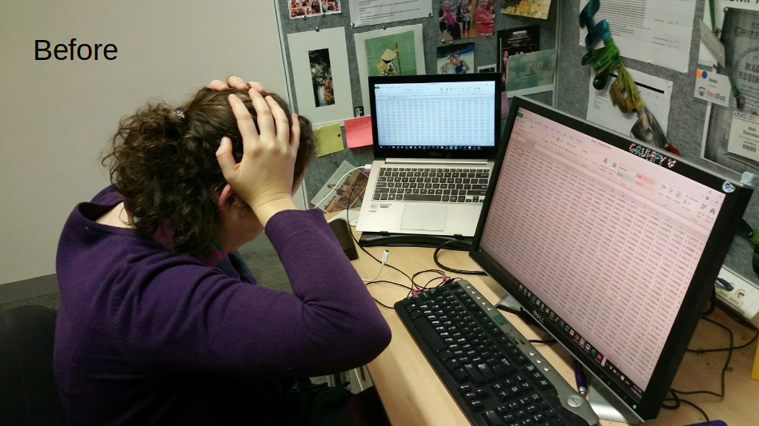
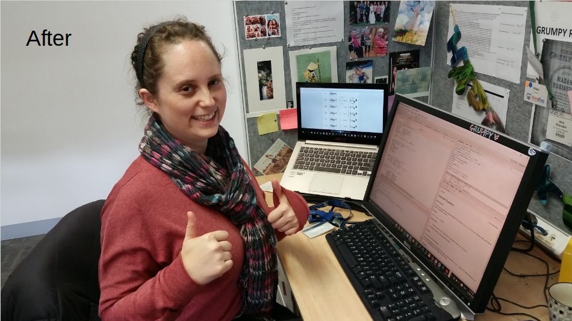
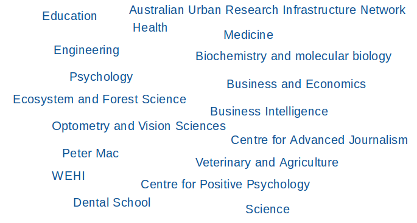

  

# Background

In this section you will learn about using R for research.

 

---

**Table of Contents**

<!-- toc -->

 

---

## The origins of R

R was created by Ross Ihaka and Robert Gentleman at the University of Auckland, New Zealand, and is based on the programming language S (although normally you would expect S to come AFTER R!). The name R came from the first names of its two creators, as well as being a play on the name of S. The first stable version of R was released in 2000. At the date of writing this chapter, R is currently on version 3.3.2. 

 

---

## My journey to R

I am currently enrolled in a PhD in the Department of Optometry and Vision Sciences at The University of Melbourne. Before the PhD, I completed both a Bachelor of Optometry and a Masters of Philosophy in optometry. 

I didn’t know any programming when I started my PhD in 2013. Here we have some before and after pictures. During my masters reanalysing my data in excel was a nightmare. Painstakingly slow and prone to error during zombie-like copy and paste sessions. And I had to reanalyse my data *over* and *over*. As my supervisor likes to say, that’s why it’s called RE-search. This will probably sound familiar to many of you who have undertaken any research. 

But now I use R. When my data changes, I just modify a few commands to rerun my analyses and generate new plots. This process is much faster and much less error-prone. 

<!--{ width=250px } { width=250px }--> 

 

---

## Why use R?

Is R a tool that you should be using? Do you have data that you need to manipulate? Do you need to perform statistical analyses? Do you need to plot your data? Do you think that graphs produced by Microsoft Excel are ugly? If you answered yes to any of these questions, then R may be the tool for you! Did I mention that it’s free? If you’re not sold yet, here is a list of some of the groups in the university that are using R. If your area of research is mentioned, R may be for you.

 

---

## R and data manipulation

R is great for data manipulation and scales really well with the size of the dataset. Do you need to move from long to wide format? Are you trying to create a frequency table? Manipulating data with 100 observations, 1000 observations or 100000 observations - it’s all the same to R. You use the same commands and get R to do all the grunt work.

 

---

## R and statistical analysis

R is geared towards statistical analysis and has many easy-to-use inbuilt statistical functions. And for anything that is not inbuilt, there are many third-party packages readily available to meet your statistical analysis needs. Installing packages is incredibly easy in R, using the command `install.packages()`. 

 

---

## R and plotting

R is famous for its easily reproducible publication quality graphics. It’s easy to make beautiful plots that change as you update your data. In the next section you will see some examples of published figures that were produced using R.
